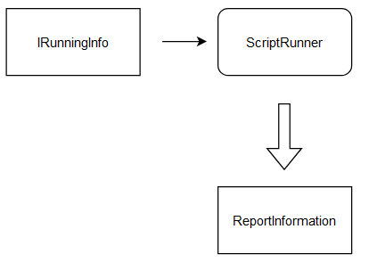

# Gosling Load Tester
[Ссылка на все диаграммы](https://drive.google.com/file/d/1UzjaO38FEpLIPxPyKALYyOObZE3fQr39/view?usp=sharing)
## Требования к проекту и MVP
1. Что можно вынести на базовый MVP? 
	* Пока тестер умеет только "бомбить" сервер определенное количество раз параллельно
	* Скрипты тестировочных сценариев (по началу простой парсинг JSON)  
	* Поддержка протоколов:  
	    1. HTTP/HTTPS (с подгрузкой сертификатов)  
	    2. TCP/UDP  
	    3. FTP  
	*  Генерируемый отчет для просмотра в браузере  
	*  Запись работы сценария (файл логов)  
2. Прокаченный MVP
	* Консольный псевдоинтерфейс (как у htop) 
	* Поддержка встраивания в pipeline (GitLab CI, Jenkins Plugin)  
	* Простой скриптовый язык для настройки сценариев (вместо Java/Scala)
	* Поддержка WebSocket  
3. МVP, к которому хочется стремиться  
	* Поддержка Protocol Buffers & gRPC (было б хорошей фишкой)
	* Поддержка различных типов тестирования

## Базовая архитектура

## Script Parser
Парсер языка сценариев запуска тестирования сервиса (или простой конфигурации в виде JSON-файлов):
1. Импортирует конфигурацию из текстового файла или поданного на вход готового текста.
2. Подготавливает специфичные для каждого протокола данные и отправляет их в виде предопределенной структуры сервисам, отвечающим за подготовку окружения тестов
3. Для каждого протокола передачи будет заранее определен формат специфичных для него данных

Возможные прототипы структур с метаданными тестирования:

## Socket Preparing 
По сути, этот узел должен отвечать за обработку полученных от парсера параметров тестирования и преобразовать все в единый план тестирования, чтобы его можно было отправить на запуск в машине потоков Script Running. Единый план будет представлен структурой интерфейса IRunningInfo с методом Run, чтобы Script Running не был связан с настройкой запуска, а просто начинал сразу работать.

## Script Running
Тот самый узел, в котором делается вся основная работа, а именно в тысячах, миллионах и миллиардов горутин (ну типа местных прокаченных потоках) DDoS-ятся самые крутые сервера и приложения. Первоначальный вариант сценария: запускается определенное количество горутин с заранее установленным контекстом с таймаутом, запускается таймер подсчета времени нагрузки на сервер, после чего горутина запускает переданный ей колбек и ждет ответа, собирая при этом нужную ей информацию или в случае неуспеха извещает об ошибке главный поток. Он в свою очередь собирает всю поступающую информацию, обобщает ее и выдает некоторые данные для составления отчета:

## Report Generation
После завершения тестирования ScriptRunner отправляет структуру ReportInformation с данными для анализа, такими как временные ряды нагрузки на сеть, процент успешных/проваленных попыток обращения к серверу и получения от него корректных данных и тд. На их основе через шаблонизатор Go будет формироваться HTML-страничка с данными (возможно даже с графиками), которая будет сохраняться в настройках для ее просмотра:

